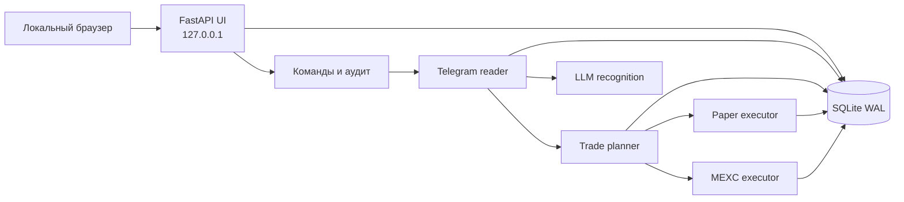

# Локальный Web UI — архитектура и план MVP

Статус: десятая итерация (guarded Live-контур без выполненных реальных заявок) реализована в коде 2026-10-04.

## Цель

Локальная панель управления и наблюдения за Telegram trader. На первом этапе она показывает реально существующие данные распознавания и позволяет менять безопасные настройки. Возможности paper/live появляются в интерфейсе только вместе с соответствующим исполнительным модулем: UI не должен создавать видимость работающей торговли.

Начальные условия:

- интерфейс на русском языке;
- один локальный владелец;
- привязка только к `127.0.0.1`, без доступа из локальной сети и интернета;
- SQLite остаётся хранилищем MVP, PostgreSQL рассматривается перед VPS или несколькими процессами исполнения;
- Telegram reader и Web UI работают отдельными процессами и используют одну схему данных;
- режим исполнения глобальный, настройки банков и размера входа задаются по каналам;
- режим подтверждений `manual/auto` является отдельной настройкой и не смешивается с `recognition/paper/live`.

## Варианты

### 1. Streamlit

Самый быстрый путь к таблицам и графикам. Подходит для временной аналитической панели. Приложение повторно выполняет Python-скрипт при взаимодействиях, поэтому управление долгоживущими процессами, аудит критичных действий и постепенное развитие в полноценную панель потребуют обходных решений.

### 2. FastAPI + Jinja2 + HTMX — выбранный вариант

Один Python-стек с текущим сервисом. FastAPI отдаёт страницы и HTML-фрагменты, Jinja2 формирует разметку, HTMX обновляет состояние без полноценного SPA. Начальное обновление — polling раз в 2–3 секунды; SSE можно добавить позднее. Статические зависимости хранятся локально, UI не зависит от CDN.

Преимущества для проекта:

- нет отдельной модели состояния в React и обязательного Node runtime на VPS;
- UI использует те же Pydantic-модели и слой доступа к данным;
- удобно добавлять безопасные POST-действия, аудит и проверки версии состояния;
- позже можно сохранить API и заменить отдельные страницы SPA-клиентом без переделки торгового ядра.

### 3. FastAPI API + React/Vite

Лучший запас для сложного терминала с большим количеством интерактивных графиков. Для текущего MVP добавляет отдельную сборку, TypeScript-модели, API-контракты и больше инфраструктуры. Имеет смысл вернуться к этому варианту, если панель превратится в самостоятельный продукт или потребует сложного real-time терминала.

## Архитектура

Web UI не вызывает MEXC напрямую. Изменение настройки или подтверждение создаёт версионированную команду в базе. Исполнитель повторно проверяет режим, состояние позиции, бюджет и идемпотентность перед действием.

## Режимы

В интерфейсе показываются три взаимоисключающих режима исполнения:

1. `recognition` — чтение и распознавание, без позиций и ордеров;
2. `paper` — чтение, распознавание и виртуальное исполнение на рыночных данных;
3. `live` — чтение, распознавание и реальные действия через MEXC.

Отдельно выбирается режим подтверждений:

- `manual` — каждое действие ожидает подтверждения;
- `auto` — разрешённые и полностью определённые действия исполняются автоматически.

В первом UI MVP активен только `recognition`. `paper` и `live` видны с объяснением недостающих компонентов, но заблокированы. Paper включается после появления состояния позиций и paper executor.

Live нельзя включить одним обычным переключателем. Активация требует готового адаптера, успешной проверки MEXC, отсутствия конфликтующих состояний, отдельного подтверждения владельца и записи в аудит. Переход из live в более безопасный режим доступен сразу, но политика существующих ордеров и позиций должна быть показана до применения.

## Страницы MVP

### Обзор

- состояние reader, время heartbeat и последней ошибки;
- соединения Telegram, LLM и позднее MEXC;
- текущий режим исполнения и режим подтверждений;
- число активных каналов, последние посты, ошибки распознавания, открытые позиции;
- краткие показатели банков и PnL, когда появится исполнение.

### Каналы

- название, Telegram ID, включён ли мониторинг;
- время последнего увиденного и распознанного сообщения;
- режим/готовность канала;
- выделенный лимит банка;
- способ размера входа: фиксированный USDT или процент исходного лимита;
- занятая и свободная маржа, реализованный и нереализованный PnL после появления execution.

MVP мигрировал начальный канал в таблицу каналов. Reader уже получает актуальный список всех включённых каналов из базы, поэтому UI показывает реальные источники.

### Посты и распознавания

- фильтры по каналу, дате, статусу, тикеру и действию;
- исходный текст, миниатюры изображений, Reply-связь и ссылка на Telegram;
- структурированный результат, вопросы, ошибки и версии повторного разбора;
- связь с торговым планом и сделкой, когда они появятся;
- безопасная команда повторного разбора с явным предупреждением о расходе LLM.

### Сделки

В recognition MVP отображается пустое состояние с пояснением. После paper engine:

- источник и канал;
- symbol, side, leverage, isolated, маржа;
- статус плана, заявки и позиции;
- средняя цена, остаток, SL/TP;
- realized/unrealized PnL, комиссии и причина закрытия;
- хронология действий и подтверждений.

### Статистика

До paper engine: число постов, успешных/ошибочных разборов, типы сигналов и расход LLM по каналам. После исполнения: число сделок, win rate, PnL, комиссии/funding, просадка, использование банка, пропуски и их причины.

### Настройки и журнал

- pause/resume распознавания;
- глобальный execution mode и approval mode;
- настройки каналов и банков;
- состояние зависимостей без отображения секретов;
- журнал изменений режима, банков, подтверждений и административных действий.

## Данные и миграции

Для MVP добавляются версионированные миграции и таблицы:

- `schema_migrations`;
- `channels` и `channel_settings`;
- `app_settings` с версиями режима;
- `service_heartbeats`;
- `control_commands`;
- `audit_log`.

Существующие `events`, `analysis_revisions`, `agent_attempts` и `usage` сохраняются. Для событий добавляются время получения, нормализованная связь с каналом и удобные поля чтения либо отдельное представление. JSON оригинала и анализа остаётся первичным доказательством.

Торговые итерации добавили:

- `trade_plans`;
- `approvals`;
- `positions`;
- `paper_orders`, `paper_fills` и `paper_funding`;
- комиссии, realized/unrealized/funding PnL и версионированное состояние;
- статистику, вычисляемую из первичных исполнений и funding-проводок.

SQLite используется с WAL, короткими транзакциями, `busy_timeout` и отдельным соединением на запрос. Перед удалённым развёртыванием или несколькими исполнителями выполняется миграция на PostgreSQL.

## Безопасность локального MVP

- сервер слушает только `127.0.0.1`;
- мутации принимаются только методом POST с CSRF-токеном, проверкой Origin и SameSite cookie;
- `.env`, Telegram session и API-ключи никогда не возвращаются в браузер;
- все изменения режима и финансовых параметров записываются в `audit_log`;
- повторная отправка формы не создаёт повторную команду;
- live остаётся заблокирован до появления и проверки реального адаптера;
- медиа отдаётся только по ID события после проверки, что путь находится внутри `data/media`.

## Порядок реализации

### Итерация 1 — фундамент

1. Добавить FastAPI, Uvicorn и Jinja2.
2. Ввести миграции, репозитории чтения и heartbeat reader.
3. Нормализовать текущий канал и события без потери существующей базы.
4. Добавить `start-ui.cmd`, `start-all.cmd` и проверку состояния UI.

### Итерация 2 — наблюдаемый MVP

Реализована 2026-10-03.

1. Обзор состояния приложения.
2. Список каналов и сохранение банков/размера входа.
3. Лента постов, изображения и подробный разбор.
4. Фильтры, пагинация и polling обновлений.
5. Статистика распознавания и расхода LLM.

### Итерация 3 — безопасное управление

Реализована 2026-10-03.

1. Pause/resume через команды с аудитом.
2. Панель режимов; recognition работает, paper/live имеют readiness state.
3. Подключение reader к нескольким включённым каналам.
4. CSRF, проверка Origin, идемпотентность команд и тесты прав доступа к локальным файлам.

После этого UI считается MVP. Следующая разработка торгового ядра ведётся вместе с его отображением:

### Итерация 4 — trade planner и состояние сделок

Реализована 2026-10-03.

1. Версионированные `trade_plans` и схема `positions`.
2. Детерминированный расчёт маржи, среднего плеча с округлением вниз и trigger-limit.
3. Проверки обязательных полей, банка, владения позицией и одного активного плана на монету.
4. Безопасный preview в recognition, историческая проекция сохранённых разборов и связь плана с постом.
5. Раздел «Сделки» с банками, планами, будущими позициями и причинами блокировки.

### Итерация 5 — ручные approvals

Реализована 2026-10-03.

1. Подтверждение или отклонение конкретной версии плана в Web UI и Telegram.
2. Корректировка плеча, маржи и доли закрытия; текстовый ответ закрывает вопросы к плану.
3. Идемпотентные решения, проверка версии, история ревизий и аудит.
4. Повторная проверка банка, конфликта тикера и владения позицией в момент аппрува.
5. В recognition решение остаётся локальным: деньги не резервируются, позиция и ордер не создаются.

### Итерация 6 — публичные данные MEXC

Реализована 2026-10-04.

1. Read-only проверка наличия и состояния USDT perpetual без API-ключа.
2. Проверка API/isolated, диапазона плеча, шага trigger-limit и минимального/максимального объёма.
3. Текущие last/bid/ask, расчёт количества контрактов и номинала из маржи и плеча.
4. Для сигналов старше 10 минут — свечи от момента сигнала; пересечение явного SL/TP блокирует вход, неопределённый сценарий требует комментария владельца.
5. Фоновое обновление проверки, показ результата в Web UI и Telegram, повторная валидация сохранённой спецификации при ручном аппруве.

### Итерация 7 — paper executor

Реализована 2026-10-04.

1. Локальные виртуальные orders/fills/positions без приватного API MEXC.
2. Market-вход по ask для long и bid для short; reduce-only выход по противоположной стороне спреда.
3. Trigger-limit сначала ждёт пересечения, затем остаётся лимитной заявкой до доступной цены и не заменяется market.
4. Добавление, частичное/полное закрытие, occupied margin, комиссии, realized/unrealized PnL, mark price, стоп, одиночный TP и приближённая isolated liquidation.
5. Manual/auto approvals и переключение recognition/paper в Web UI; live остаётся заблокирован.
6. Telegram-уведомления и базовая paper-статистика по каналам.

### Итерация 8 — paper-аналитика и управление заявками

Реализована 2026-10-04.

1. Расширенная статистика по каналам: закрытые/открытые позиции, win rate, realized/unrealized/net PnL, комиссии, funding, занятая маржа и доходность исходного банка.
2. Кривая накопленного paper PnL и max drawdown по фактическим fills и funding-проводкам; график строится локально без CDN, показывает оси USDT/дата и переключается между 30 днями, 12 месяцами и 10 годами.
3. Учёт funding по публичной истории MEXC с идемпотентностью settlement. Историческая fair price недоступна, поэтому стоимость позиции приближённо считается по last price в момент обработки и это сохраняется в ledger.
4. Ручная отмена ожидающей или сработавшей, но ещё не исполненной trigger-limit заявки. UI ставит версионированную команду в очередь, reader применяет её, освобождает резерв и записывает аудит.
5. Миграция схемы 9 и тесты бухгалтерского соответствия fills/funding итоговому PnL.
6. Независимая SQL-пагинация позиций, виртуальных заявок и планов по 10 записей с сохранением страниц при polling и управляющих действиях.

### Итерация 9 — восстановление paper-состояния

Реализована 2026-10-04.

1. После перерыва больше минуты открытая позиция проверяется по минутным OHLC-свечам MEXC от последнего сохранённого mark; запрос ограничен документированным окном в 2000 свечей.
2. Если в первой затронутой полной свече однозначно пересечён один из SL, одиночного TP или приближённой liquidation, позиция закрывается по сохранённому уровню. Ордер и fill получают `price_source=recovery_level` и время исходной свечи.
3. Если одна свеча пересекла несколько уровней либо началась до последнего сохранённого mark, порядок событий считается неизвестным. Позиция остаётся открытой со статусом `attention`, доказательствами OHLC и списком возможных исходов; система не выбирает более выгодный вариант.
4. Пока позиция требует внимания, mark/PnL и funding продолжают обновляться, а автоматические защитные выходы приостановлены. Владелец может версионированной командой в Web UI признать исторический исход неопределённым и продолжить наблюдение с текущей цены.
5. Состояния планов, ожидающих заявок, fills и позиций сохраняются транзакционно. Тест перезапуска подтверждает, что уже подтверждённый план исполняется ровно один раз после повторного открытия базы.
6. Миграция схемы 10 хранит статус восстановления, причину, свечу, варианты исхода и источник цены исполнения; переходы записываются в аудит и Telegram-уведомления.

### Итерация 10 — guarded Live

Реализована в коде 2026-10-04; реальные write-запросы ещё не запускались.

1. Подписанный приватный MEXC-клиент использует актуальный `api.mexc.com`, не пишет секреты в БД и не повторяет write-запрос после сетевой неопределённости.
2. Read-only readiness сверяет USDT futures balance, режим позиции, открытые позиции и заявки. Cross и неизвестные приложению объекты блокируют активацию.
3. Активация разделена на свежий snapshot, точную фразу `LIVE <id>` и отдельный выбор режима. Выход из Live снимает защёлку; первый этап разрешает только manual approvals.
4. `live_orders` сохраняет детерминированный `externalOid` до запроса. Market/trigger-limit используют `openType=1`; закрытия содержат `positionId` и `reduceOnly`.
5. Неизвестный результат не переотправляется и сверяется read-only запросом по `externalOid`. Расхождение автоматически снимает защёлку.
6. Web UI показывает readiness и последние Live-заявки; локальный trigger и биржевой open order можно отменить версионированной командой.
7. Схема 11 добавляет snapshots, Live journal и exchange identity для позиций.

Следующий этап: read-only проверка на пользовательском ключе, затем отдельно подтверждённый минимальный Live-тест и сверка фактических fills/fees.

## Критерии готовности MVP

- одна команда запускает reader и Web UI;
- страница открывается локально и показывает фактическое состояние процесса;
- текущий и новые настроенные каналы отражаются из базы;
- новые посты появляются без ручной перезагрузки всей страницы;
- доступны исходное сообщение, медиа, разбор, вопросы и ошибка;
- банк и правило размера входа сохраняются по каналу и попадают в аудит;
- pause/resume работает через очередь команд;
- недоступный paper/live нельзя выдать за активный;
- перезапуск UI не влияет на Telegram reader;
- существующие события и их версии сохраняются после миграции.
